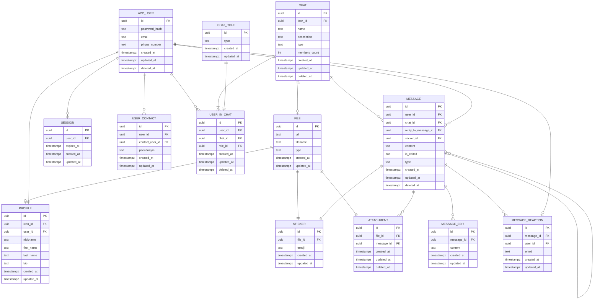

```mermaid
erDiagram
FILE ||--o| PROFILE : ""
FILE ||--|| STICKER : ""
FILE ||--|| ATTACHMENT : ""
APP_USER ||--|| PROFILE : ""
APP_USER ||--o{ SESSION : ""
APP_USER ||--o{ USER_CONTACT : ""
APP_USER ||--o{ USER_IN_CHAT : ""
CHAT ||--|{ USER_IN_CHAT : ""
CHAT_ROLE ||--|| USER_IN_CHAT : ""
CHAT ||--o{ MESSAGE : ""
APP_USER ||--o{ MESSAGE : ""
MESSAGE o|--o{ MESSAGE : ""
MESSAGE ||--|| STICKER : ""
MESSAGE ||--o{ ATTACHMENT : ""
MESSAGE ||--o{ MESSAGE_EDIT : ""
MESSAGE ||--o{ MESSAGE_REACTION : ""
APP_USER ||--o| MESSAGE_REACTION : ""
CHAT ||--o| FILE : ""

FILE {
uuid id PK
text url
text filename
text type
timestampz created_at
timestampz updated_at
}
PROFILE {
uuid id PK
uuid icon_id FK
uuid user_id FK
text nickname
text first_name
text last_name
text bio
timestampz created_at
timestampz updated_at
}
SESSION {
uuid id PK
uuid user_id FK
timestampz expires_at
timestampz created_at
timestampz updated_at
}
APP_USER {
uuid id PK
text password_hash
text email
text phone_number
timestampz created_at
timestampz updated_at
timestampz deleted_at
}
USER_CONTACT {
uuid id PK
uuid user_id FK
uuid contact_user_id FK
text pseudonym
timestampz created_at
timestampz updated_at
}
CHAT {
uuid id PK
uuid icon_id FK
text name
text description
text type
int members_count
timestampz created_at
timestampz updated_at
timestampz deleted_at
}
CHAT_ROLE {
uuid id PK
text type
timestampz created_at
timestampz updated_at  
}
USER_IN_CHAT {
uuid id PK
uuid user_id FK
uuid chat_id FK
uuid role_id FK
timestampz created_at
timestampz updated_at
timestampz deleted_at
}
MESSAGE {
uuid id PK
uuid user_id FK
uuid chat_id FK
uuid reply_to_message_id FK
uuid sticker_id FK
text content
bool is_edited
text type
timestampz created_at
timestampz updated_at
timestampz deleted_at
}
MESSAGE_EDIT {
uuid id PK
uuid message_id FK
text content
timestampz created_at
timestampz updated_at
}
MESSAGE_REACTION {
uuid id PK
uuid message_id FK
uuid user_id FK
text emoji
timestampz created_at
timestampz updated_at
}
STICKER {
uuid id PK
uuid file_id FK
text emoji
timestampz created_at
timestampz updated_at
}
ATTACHMENT {
uuid id PK
uuid file_id FK
uuid message_id FK
timestampz created_at
timestampz updated_at
timestampz deleted_at
}
```
