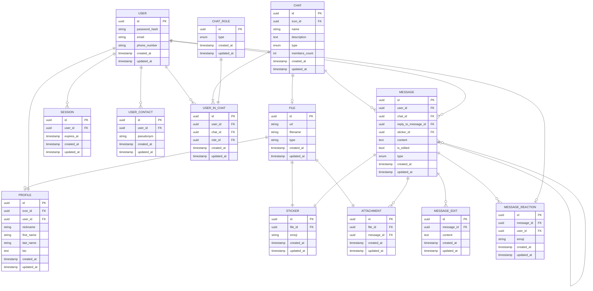

```mermaid
erDiagram
FILE ||--o| PROFILE : ""
FILE ||--|| STICKER : ""
FILE ||--|| ATTACHMENT : ""
USER ||--|| PROFILE : ""
USER ||--o{ SESSION : ""
USER ||--o{ USER_CONTACT : ""
USER ||--o{ USER_IN_CHAT : ""
CHAT ||--|{ USER_IN_CHAT : ""
CHAT_ROLE ||--|| USER_IN_CHAT : ""
CHAT ||--o{ MESSAGE : ""
USER ||--o{ MESSAGE : ""
MESSAGE o|--o{ MESSAGE : ""
MESSAGE ||--|| STICKER : ""
MESSAGE ||--o{ ATTACHMENT : ""
MESSAGE ||--o{ MESSAGE_EDIT : ""
MESSAGE ||--o{ MESSAGE_REACTION : ""
USER ||--o| MESSAGE_REACTION : ""
CHAT ||--o| FILE : ""

FILE {
uuid id PK
string url
string filename
string type
timestamp created_at
timestamp updated_at
}
PROFILE {
uuid id PK
uuid icon_id FK
uuid user_id FK
string nickname
string first_name
string last_name
text bio
timestamp created_at
timestamp updated_at
}
SESSION {
uuid id PK
uuid user_id FK
timestamp expires_at
timestamp created_at
timestamp updated_at
}
USER {
uuid id PK
string password_hash
string email
string phone_number
timestamp created_at
timestamp updated_at
}
USER_CONTACT {
uuid id PK
uuid user_id FK
string pseudonym
timestamp created_at
timestamp updated_at
}
CHAT {
uuid id PK
uuid icon_id FK
string name
text description
enum type
int members_count
timestamp created_at
timestamp updated_at
}
CHAT_ROLE {
uuid id PK
enum type
timestamp created_at
timestamp updated_at  
}
USER_IN_CHAT {
uuid id PK
uuid user_id FK
uuid chat_id FK
uuid role_id FK
timestamp created_at
timestamp updated_at
}
MESSAGE {
uuid id PK
uuid user_id FK
uuid chat_id FK
uuid reply_to_message_id FK
uuid sticker_id FK
text content
bool is_edited
enum type
timestamp created_at
timestamp updated_at
}
MESSAGE_EDIT {
uuid id PK
uuid message_id FK
text content
timestamp created_at
timestamp updated_at
}
MESSAGE_REACTION {
uuid id PK
uuid message_id FK
uuid user_id FK
string emoji
timestamp created_at
timestamp updated_at
}
STICKER {
uuid id PK
uuid file_id FK
string emoji
timestamp created_at
timestamp updated_at
}
ATTACHMENT {
uuid id PK
uuid file_id FK
uuid message_id FK
timestamp created_at
timestamp updated_at
}
```
