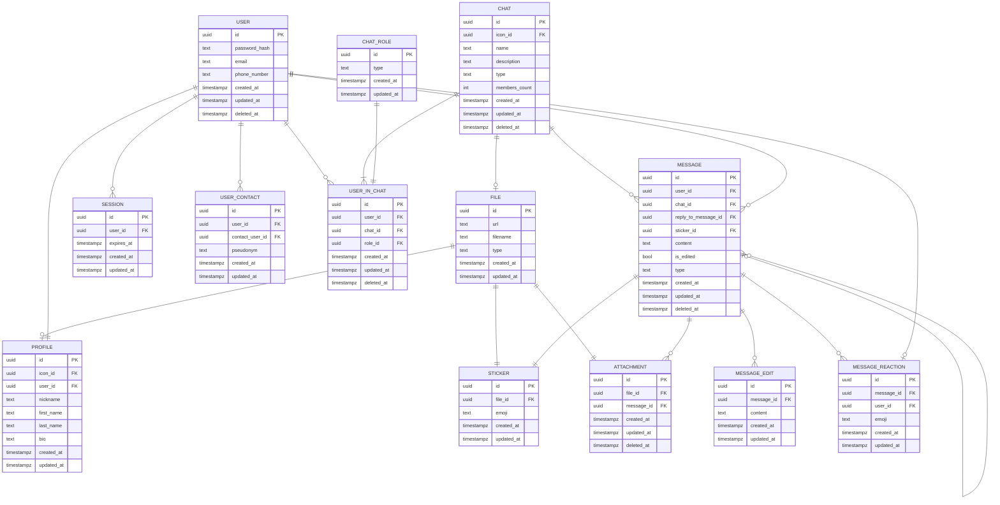

## Таблица `FILE`
Хранит метаданные загруженного файла для использования в профиле, стикерах и вложениях
**Функциональные зависимости:**  
`{id} -> {url, filename, type, created_at, updated_at}`  
Таблица соответствует:
- **1 нормальной форме**, т.к. каждый кортеж содержит ровно одно значение каждого атрибута;
- **2 нормальной форме**, т.к. первичный ключ `id` не составной, частичных зависимостей нет;
- **3 нормальной форме**, т.к. все неключевые атрибуты зависят только от `id`, транзитивных зависимостей нет;
- **нормальной форме Бойса-Кодда**, т.к. единственный детерминант `id` является потенциальным ключом.
## Таблица `PROFILE`
Хранит все данные пользователя, которые будут отображаться в профиле: ник, имя, фамилию, аватар и био
**Функциональные зависимости:**  
`{id} -> {icon_id, user_id, nickname, first_name, last_name, bio, created_at, updated_at}`  
Таблица соответствует:
- **1 нормальной форме**, т.к. каждый кортеж содержит ровно одно значение каждого атрибута;
- **2 нормальной форме**, т.к. первичный ключ `id` не составной, частичных зависимостей нет;
- **3 нормальной форме**, т.к. все неключевые атрибуты зависят только от `id`, транзитивных зависимостей нет;
- **нормальной форме Бойса-Кодда**, т.к. единственный детерминант `id` является потенциальным ключом.
## Таблица `SESSION`
Хранит сессии пользователя
**Функциональные зависимости:**  
`{id} -> {user_id, expires_at, created_at, updated_at}`  
Таблица соответствует:
- **1 нормальной форме**, т.к. каждый кортеж содержит ровно одно значение каждого атрибута;
- **2 нормальной форме**, т.к. первичный ключ `id` не составной, частичных зависимостей нет;
- **3 нормальной форме**, т.к. все неключевые атрибуты зависят только от `id`, транзитивных зависимостей нет;
- **нормальной форме Бойса-Кодда**, т.к. единственный детерминант `id` является потенциальным ключом.
## Таблица `USER`
Хранит учётные данные для входа: почта, телефон и хеш пароля.
**Функциональные зависимости:**  
`{id} -> {password_hash, email, phone_number, created_at, updated_at, deleted_at}`  
Дополнительно: если `email` или `phone_number` объявлены уникальными, то `{email}` и/или `{phone_number}` также являются потенциальными ключами.  
Таблица соответствует:
- **1 нормальной форме**, т.к. каждый кортеж содержит ровно одно значение каждого атрибута;
- **2 нормальной форме**, т.к. первичный ключ `id` не составной, частичных зависимостей нет;
- **3 нормальной форме**, т.к. все неключевые атрибуты зависят только от `id`, транзитивных зависимостей нет;
- **нормальной форме Бойса-Кодда**, т.к. единственный детерминант `id` является потенциальным ключом.
## Таблица `USER_CONTACT`
Связывает пользователя с контактом (типо друзья), можно добавить локальный псевдоним контакту
**Функциональные зависимости:**  
`{id} -> {user_id, contact_user_id, pseudonym, created_at, updated_at}`  
Таблица соответствует:
- **1 нормальной форме**, т.к. каждый кортеж содержит ровно одно значение каждого атрибута;
- **2 нормальной форме**, т.к. первичный ключ `id` не составной, частичных зависимостей нет;
- **3 нормальной форме**, т.к. все неключевые атрибуты зависят только от `id`, транзитивных зависимостей нет;
- **нормальной форме Бойса-Кодда**, т.к. единственный детерминант `id` является потенциальным ключом.
## Таблица `CHAT`
Хранит чат (диалог, группу или канал) с названием, описанием, типом и иконкой
**Функциональные зависимости:**  
`{id} -> {icon_id, name, description, type, members_count, created_at, updated_at, deleted_at}`  
Таблица соответствует:
- **1 нормальной форме**, т.к. каждый кортеж содержит ровно одно значение каждого атрибута;
- **2 нормальной форме**, т.к. первичный ключ `id` не составной, частичных зависимостей нет;
- **3 нормальной форме**, т.к. все неключевые атрибуты зависят только от `id`, транзитивных зависимостей нет;
- **нормальной форме Бойса-Кодда**, т.к. единственный детерминант `id` является потенциальным ключом.
## Таблица `CHAT_ROLE`
Справочник для возможных ролей участников чата (создатель, админ, обычный юзер)
**Функциональные зависимости:**  
`{id} -> {type, created_at, updated_at}`  
Таблица соответствует:
- **1 нормальной форме**, т.к. каждый кортеж содержит ровно одно значение каждого атрибута;
- **2 нормальной форме**, т.к. первичный ключ `id` не составной, частичных зависимостей нет;
- **3 нормальной форме**, т.к. все неключевые атрибуты зависят только от `id`, транзитивных зависимостей нет;
- **нормальной форме Бойса-Кодда**, т.к. единственный детерминант `id` является потенциальным ключом.
## Таблица `USER_IN_CHAT`
Промежуточная таблица, хранящая участие пользователя в чате и его роль
**Функциональные зависимости:**  
`{id} -> {user_id, chat_id, role_id, created_at, updated_at, deleted_at}`  
Дополнительно: если на пару `(user_id, chat_id)` наложено ограничение `UNIQUE`, то `{user_id, chat_id}` — потенциальный ключ.  
Таблица соответствует:
- **1 нормальной форме**, т.к. каждый кортеж содержит ровно одно значение каждого атрибута;
- **2 нормальной форме**, т.к. первичный ключ `id` не составной, частичных зависимостей нет;
- **3 нормальной форме**, т.к. все неключевые атрибуты зависят только от `id`, транзитивных зависимостей нет;
- **нормальной форме Бойса-Кодда**, т.к. единственный детерминант `id` является потенциальным ключом.
## Таблица `MESSAGE`
Хранит сообщение в конкретном чате. Поддерживается ответы на сообщения (рекурсивная связь `reply_to_message_id`), два типа сообщений: текстовое (`sticker_id = null`) или стикер (`content = null`)
**Функциональные зависимости:**  
`{id} -> {user_id, chat_id, reply_to_message_id, sticker_id, content, is_edited, type, created_at, updated_at, deleted_at}`  
Таблица соответствует:
- **1 нормальной форме**, т.к. каждый кортеж содержит ровно одно значение каждого атрибута;
- **2 нормальной форме**, т.к. первичный ключ `id` не составной, частичных зависимостей нет;
- **3 нормальной форме**, т.к. все неключевые атрибуты зависят только от `id`, транзитивных зависимостей нет;
- **нормальной форме Бойса-Кодда**, т.к. единственный детерминант `id` является потенциальным ключом.
## Таблица `MESSAGE_EDIT`
Хранит историю редактирований сообщения
**Функциональные зависимости:**  
`{id} -> {message_id, content, created_at, updated_at}`  
Таблица соответствует:
- **1 нормальной форме**, т.к. каждый кортеж содержит ровно одно значение каждого атрибута;
- **2 нормальной форме**, т.к. первичный ключ `id` не составной, частичных зависимостей нет;
- **3 нормальной форме**, т.к. все неключевые атрибуты зависят только от `id`, транзитивных зависимостей нет;
- **нормальной форме Бойса-Кодда**, т.к. единственный детерминант `id` является потенциальным ключом.
## Таблица `MESSAGE_REACTION`
Хранит реакцию пользователя (исключительно эмодзи) на конкретное сообщение
**Функциональные зависимости:**  
`{id} -> {message_id, user_id, emoji, created_at, updated_at}`  
Дополнительно: если на `(message_id, user_id, emoji)` наложено ограничение `UNIQUE`, то этот набор — потенциальный ключ.  
Таблица соответствует:
- **1 нормальной форме**, т.к. каждый кортеж содержит ровно одно значение каждого атрибута;
- **2 нормальной форме**, т.к. первичный ключ `id` не составной, частичных зависимостей нет;
- **3 нормальной форме**, т.к. все неключевые атрибуты зависят только от `id`, транзитивных зависимостей нет;
- **нормальной форме Бойса-Кодда**, т.к. единственный детерминант `id` является потенциальным ключом.
## Таблица `STICKER`
Таблица всех стикеров (глобальная), стикер паков нету
**Функциональные зависимости:**  
`{id} -> {file_id, emoji, created_at, updated_at}`  
Таблица соответствует:
- **1 нормальной форме**, т.к. каждый кортеж содержит ровно одно значение каждого атрибута;
- **2 нормальной форме**, т.к. первичный ключ `id` не составной, частичных зависимостей нет;
- **3 нормальной форме**, т.к. все неключевые атрибуты зависят только от `id`, транзитивных зависимостей нет;
- **нормальной форме Бойса-Кодда**, т.к. единственный детерминант `id` является потенциальным ключом.
## Таблица `ATTACHMENT`
Хранит вложение сообщения, привязанное к файлу.
**Функциональные зависимости:**  
`{id} -> {file_id, message_id, created_at, updated_at, deleted_at}`  
Таблица соответствует:
- **1 нормальной форме**, т.к. каждый кортеж содержит ровно одно значение каждого атрибута;
- **2 нормальной форме**, т.к. первичный ключ `id` не составной, частичных зависимостей нет;
- **3 нормальной форме**, т.к. все неключевые атрибуты зависят только от `id`, транзитивных зависимостей нет;
- **нормальной форме Бойса-Кодда**, т.к. единственный детерминант `id` является потенциальным ключом.

